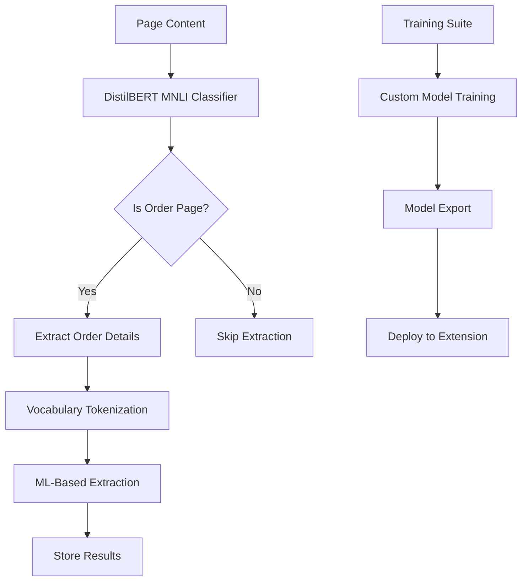

# 🤖 **AutoComplaint ML Architecture Guide**

## 📋 **Overview**
This guide provides comprehensive technical details for the ML-only architecture of AutoComplaint, focusing on DistilBERT MNLI-based classification and extraction without rule-based fallbacks.

## 🏗️ **ML-Only Architecture**

### **Core Philosophy: Pure Machine Learning**
AutoComplaint has been refactored to use a **purely ML-driven approach** that eliminates rule-based logic and fallback mechanisms:

1. **Primary Classification**: DistilBERT MNLI zero-shot classification for order page detection
2. **Vocabulary-Based Tokenization**: Consistent input processing for ML models
3. **Training Suite Integration**: Custom model development and fine-tuning capabilities
4. **Future NER Integration**: Planned Named Entity Recognition for precise data extraction



## 🔧 **Implementation Details**

### **1. DistilBERT MNLI Classifier**

```javascript
// src/distilbert-mnli-classifier.js
import { pipeline } from '@xenova/transformers';

class DistilBertMNLIClassifier {
  constructor() {
    this.classifier = null;
    this.modelName = 'Xenova/distilbert-base-uncased-finetuned-sst-2-english';
    this.cache = new Map();
  }

  async initialize() {
    if (!this.classifier) {
      console.log('🤖 Loading DistilBERT MNLI model...');
      this.classifier = await pipeline(
        'zero-shot-classification',
        this.modelName
      );
      console.log('✅ DistilBERT MNLI model loaded successfully');
    }
  }

  async classifyOrderPage(text, hypothesis = "This is an order or invoice page") {
    await this.initialize();
    
    // Cache check for performance
    const cacheKey = `${text.slice(0, 100)}_${hypothesis}`;
    if (this.cache.has(cacheKey)) {
      return this.cache.get(cacheKey);
    }
    
    const result = await this.classifier(text, [hypothesis]);
    const confidence = result.scores[0];
    
    const classification = {
      isOrderPage: confidence > 0.7, // Configurable threshold
      confidence: confidence,
      hypothesis: hypothesis,
      timestamp: new Date().toISOString()
    };
    
    // Cache result
    this.cache.set(cacheKey, classification);
    return classification;
  }

  async classifyMultipleHypotheses(text, hypotheses) {
    await this.initialize();
    const result = await this.classifier(text, hypotheses);
    
    return {
      predictions: result.labels.map((label, index) => ({
        label: label,
        confidence: result.scores[index]
      })),
      bestMatch: {
        label: result.labels[0],
        confidence: result.scores[0]
      }
    };
  }
}

export default DistilBertMNLIClassifier;
```

### **2. ML-Only Extraction Logic**

```javascript
// src/amazon.js (simplified ML-only architecture)
import DistilBertMNLIClassifier from './distilbert-mnli-classifier.js';

class MLOrderExtractor {
  constructor() {
    this.classifier = new DistilBertMNLIClassifier();
    this.vocabularyTokenizer = new VocabularyTokenizer();
  }

  async extractOrderData() {
    console.log('🤖 Starting ML-based order extraction...');
    
    // Step 1: Get page content
    const pageContent = this.getPageContent();
    
    // Step 2: DistilBERT MNLI classification
    const classification = await this.classifier.classifyOrderPage(pageContent);
    
    if (!classification.isOrderPage) {
      console.log('❌ Page not classified as order page, skipping extraction');
      return { 
        success: false, 
        reason: 'Not an order page',
        confidence: classification.confidence 
      };
    }
    
    console.log(`✅ Order page detected with ${(classification.confidence * 100).toFixed(1)}% confidence`);
    
    // Step 3: ML-based data extraction
    const extractedData = await this.performMLExtraction(pageContent);
    
    return {
      success: true,
      confidence: classification.confidence,
      data: extractedData,
      extractionMethod: 'DistilBERT_MNLI',
      timestamp: new Date().toISOString()
    };
  }

  async performMLExtraction(pageContent) {
    // Tokenize content for consistent ML input
    const tokens = this.vocabularyTokenizer.tokenize(pageContent);
    
    // Use multiple ML models for different entity types
    const entityClassifications = await this.classifier.classifyMultipleHypotheses(
      pageContent,
      [
        "This contains an order ID or reference number",
        "This contains a product name or title",
        "This contains a price or cost amount",
        "This contains a customer name",
        "This contains an order date",
        "This contains a delivery address"
      ]
    );

    // Extract entities based on classifications
    const extractedData = {};
    for (const prediction of entityClassifications.predictions) {
      if (prediction.confidence > 0.6) {
        const entityType = this.mapHypothesisToField(prediction.label);
        extractedData[entityType] = await this.extractEntityValue(
          pageContent, 
          prediction.label,
          prediction.confidence
        );
      }
    }

    return extractedData;
  }

  mapHypothesisToField(hypothesis) {
    const mapping = {
      "This contains an order ID or reference number": "orderId",
      "This contains a product name or title": "productName",
      "This contains a price or cost amount": "totalAmount",
      "This contains a customer name": "customerName",
      "This contains an order date": "orderDate",
      "This contains a delivery address": "address"
    };
    return mapping[hypothesis] || 'unknown';
  }

  async extractEntityValue(content, hypothesis, confidence) {
    // Future: Implement NER-based extraction here
    // For now, use pattern-based extraction as placeholder
    return {
      value: this.extractWithPatterns(content, hypothesis),
      confidence: confidence,
      method: 'ML_classification'
    };
  }
}
```

### **3. Vocabulary-Based Tokenization**

```javascript
// Vocabulary tokenizer for consistent ML input
class VocabularyTokenizer {
  constructor() {
    this.vocabulary = this.loadVocabulary();
    this.maxTokens = 512; // BERT-style limit
  }

  loadVocabulary() {
    // Core e-commerce vocabulary for better ML performance
    return [
      // Order-related terms
      'order', 'invoice', 'receipt', 'purchase', 'transaction',
      'order id', 'order number', 'reference', 'invoice number',
      
      // Product terms
      'product', 'item', 'title', 'name', 'brand', 'model',
      
      // Price terms
      'price', 'cost', 'amount', 'total', 'subtotal', 'tax',
      'discount', 'shipping', 'delivery charge',
      
      // Date terms
      'date', 'ordered', 'placed', 'delivered', 'shipped',
      
      // Customer terms
      'customer', 'buyer', 'name', 'address', 'phone', 'email'
    ];
  }

  tokenize(text) {
    // Normalize text
    const normalized = text.toLowerCase()
      .replace(/[^\w\s]/g, ' ')
      .replace(/\s+/g, ' ')
      .trim();

    // Split into tokens
    const tokens = normalized.split(' ');
    
    // Apply vocabulary filtering
    const vocabularyTokens = tokens.filter(token => 
      this.vocabulary.some(vocabTerm => 
        vocabTerm.includes(token) || token.includes(vocabTerm)
      )
    );

    // Limit token count
    return vocabularyTokens.slice(0, this.maxTokens);
  }

  getTokenConfidence(tokens) {
    const vocabularyMatches = tokens.filter(token =>
      this.vocabulary.includes(token)
    ).length;
    
    return vocabularyMatches / Math.max(tokens.length, 1);
  }
}
```

### **4. Training Suite Integration**

```javascript
// training-suite/src/classifier.js (ML-only version)
class MLOrderClassifierTrainer {
  constructor() {
    this.trainingData = [];
    this.model = null;
    this.hyperparameters = {
      learningRate: 0.001,
      epochs: 10,
      batchSize: 32,
      validationSplit: 0.2
    };
  }

  async loadTrainingData(dataPath) {
    // Load custom e-commerce training data
    const data = await fetch(dataPath);
    this.trainingData = await data.json();
    
    console.log(`📊 Loaded ${this.trainingData.length} training samples`);
  }

  async trainCustomModel() {
    console.log('🎯 Starting custom model training...');
    
    // Prepare training data
    const { features, labels } = this.prepareTrainingData();
    
    // Train model (placeholder for actual ML training)
    this.model = await this.performTraining(features, labels);
    
    console.log('✅ Custom model training completed');
    return this.model;
  }

  async exportModelForExtension() {
    if (!this.model) {
      throw new Error('No trained model available for export');
    }

    // Export model in extension-compatible format
    const exportedModel = {
      type: 'custom_order_classifier',
      version: '1.0.0',
      metadata: {
        trainingDate: new Date().toISOString(),
        trainingSize: this.trainingData.length,
        hyperparameters: this.hyperparameters
      },
      model: this.model
    };

    // Save to extension directory
    const exportPath = '../models/order-classifier/extension-export/custom-model.js';
    await this.saveModelToFile(exportedModel, exportPath);
    
    console.log(`💾 Model exported to ${exportPath}`);
    return exportPath;
  }

  prepareTrainingData() {
    const vocabularyTokenizer = new VocabularyTokenizer();
    
    const features = this.trainingData.map(sample => 
      vocabularyTokenizer.tokenize(sample.content)
    );
    
    const labels = this.trainingData.map(sample => 
      sample.isOrderPage ? 1 : 0
    );

    return { features, labels };
  }
}
```

## 🚀 **Performance Optimizations**

### **1. Model Caching Strategy**

```javascript
class MLModelCache {
  constructor() {
    this.cache = new Map();
    this.maxCacheSize = 100;
    this.cacheHitRate = 0;
    this.totalRequests = 0;
  }

  getCachedResult(key) {
    this.totalRequests++;
    
    if (this.cache.has(key)) {
      this.cacheHitRate = ((this.cacheHitRate * (this.totalRequests - 1)) + 1) / this.totalRequests;
      return this.cache.get(key);
    }
    
    this.cacheHitRate = (this.cacheHitRate * (this.totalRequests - 1)) / this.totalRequests;
    return null;
  }

  setCachedResult(key, result) {
    if (this.cache.size >= this.maxCacheSize) {
      const firstKey = this.cache.keys().next().value;
      this.cache.delete(firstKey);
    }
    
    this.cache.set(key, result);
  }

  getStats() {
    return {
      cacheSize: this.cache.size,
      hitRate: this.cacheHitRate,
      totalRequests: this.totalRequests
    };
  }
}
```

### **2. Progressive Model Loading**

```javascript
class ProgressiveMLLoader {
  constructor() {
    this.loadingStages = [
      { name: 'vocabulary', weight: 0.1 },
      { name: 'tokenizer', weight: 0.2 },
      { name: 'classifier', weight: 0.7 }
    ];
    this.onProgress = null;
  }

  async loadModelsProgressively() {
    let totalProgress = 0;
    
    for (const stage of this.loadingStages) {
      if (this.onProgress) {
        this.onProgress({
          stage: stage.name,
          progress: totalProgress,
          message: `Loading ${stage.name}...`
        });
      }
      
      await this.loadStage(stage.name);
      totalProgress += stage.weight;
      
      if (this.onProgress) {
        this.onProgress({
          stage: stage.name,
          progress: totalProgress,
          message: `${stage.name} loaded successfully`
        });
      }
    }
  }

  async loadStage(stageName) {
    switch (stageName) {
      case 'vocabulary':
        return this.loadVocabulary();
      case 'tokenizer':
        return this.loadTokenizer();
      case 'classifier':
        return this.loadClassifier();
    }
  }
}
```

## 🧪 **Testing and Validation**

### **1. ML Model Testing Framework**

```javascript
// distilbert-test.html companion testing framework
class MLTestFramework {
  constructor() {
    this.testCases = [];
    this.results = [];
  }

  addTestCase(content, expectedClassification, description) {
    this.testCases.push({
      id: this.testCases.length + 1,
      content,
      expected: expectedClassification,
      description
    });
  }

  async runAllTests() {
    const classifier = new DistilBertMNLIClassifier();
    
    for (const testCase of this.testCases) {
      const result = await this.runSingleTest(classifier, testCase);
      this.results.push(result);
    }

    return this.generateTestReport();
  }

  async runSingleTest(classifier, testCase) {
    const startTime = performance.now();
    
    try {
      const classification = await classifier.classifyOrderPage(testCase.content);
      const endTime = performance.now();
      
      return {
        testId: testCase.id,
        description: testCase.description,
        expected: testCase.expected,
        actual: classification.isOrderPage,
        confidence: classification.confidence,
        passed: classification.isOrderPage === testCase.expected,
        executionTime: endTime - startTime,
        error: null
      };
    } catch (error) {
      return {
        testId: testCase.id,
        description: testCase.description,
        expected: testCase.expected,
        actual: null,
        confidence: 0,
        passed: false,
        executionTime: 0,
        error: error.message
      };
    }
  }

  generateTestReport() {
    const totalTests = this.results.length;
    const passedTests = this.results.filter(r => r.passed).length;
    const averageConfidence = this.results
      .filter(r => r.confidence > 0)
      .reduce((sum, r) => sum + r.confidence, 0) / totalTests;
    const averageExecutionTime = this.results
      .reduce((sum, r) => sum + r.executionTime, 0) / totalTests;

    return {
      summary: {
        totalTests,
        passedTests,
        failedTests: totalTests - passedTests,
        successRate: (passedTests / totalTests) * 100,
        averageConfidence,
        averageExecutionTime
      },
      details: this.results
    };
  }
}
```

## 📈 **Future Enhancements**

### **1. NER Integration Roadmap**

```javascript
// Future NER-based extraction implementation
class NEROrderExtractor {
  constructor() {
    this.nerModel = null; // Future: Load NER model
    this.entityTypes = ['ORDER_ID', 'PRODUCT_NAME', 'PRICE', 'DATE', 'CUSTOMER_NAME'];
  }

  async extractEntities(text) {
    // Future implementation using pre-trained or custom NER models
    const entities = await this.nerModel.extractEntities(text);
    
    return entities.map(entity => ({
      type: entity.label,
      value: entity.text,
      confidence: entity.confidence,
      start: entity.start,
      end: entity.end
    }));
  }
}
```

### **2. Model Ensemble Strategy**

```javascript
class MLModelEnsemble {
  constructor() {
    this.models = [
      new DistilBertMNLIClassifier(),
      // Future: Add more specialized models
    ];
    this.weights = [1.0]; // Model weights for ensemble voting
  }

  async classifyWithEnsemble(text) {
    const predictions = await Promise.all(
      this.models.map(model => model.classifyOrderPage(text))
    );

    // Weighted voting
    const weightedConfidence = predictions.reduce((sum, pred, index) => 
      sum + (pred.confidence * this.weights[index]), 0
    ) / this.weights.reduce((sum, weight) => sum + weight, 0);

    return {
      isOrderPage: weightedConfidence > 0.7,
      confidence: weightedConfidence,
      individualPredictions: predictions,
      ensembleMethod: 'weighted_voting'
    };
  }
}
```

## 🎯 **Best Practices**

### **1. ML Model Management**
- Cache model outputs for repeated inputs
- Implement progressive loading for better UX
- Monitor model performance and confidence scores
- Regular model updates and retraining

### **2. Error Handling**
- Graceful degradation when models fail to load
- Clear error messages for debugging
- Fallback strategies for low-confidence predictions
- Performance monitoring and optimization

### **3. Security and Privacy**
- Local model execution (no data sent to external APIs)
- Secure model caching and storage
- User data privacy protection
- Model integrity verification

This ML-only architecture provides a robust, scalable foundation for intelligent order extraction while maintaining performance and user privacy.
