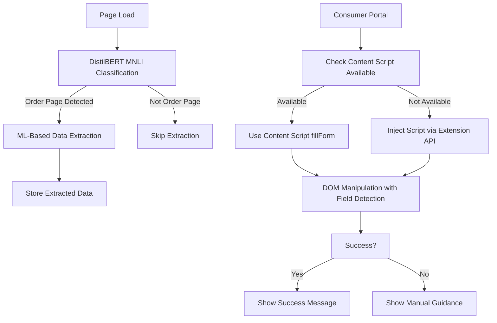

# 🛠️ **AutoComplaint Technical Implementation Guide**

## 📋 **Overview**
This guide provides comprehensive technical details for implementing robust, maintainable semi-automated form filling in the AutoComplaint browser extension. For detailed ML architecture information, see `ML_ARCHITECTURE_GUIDE.md`.

## 🎯 **Current Architecture: ML-First Hybrid Approach**

### **Core Strategy: Machine Learning + Browser Extension APIs**

Our extension now uses a **ML-first approach** with form filling capabilities:

1. **Primary Layer**: DistilBERT MNLI-based order page classification and extraction
2. **Form Filling Layer**: Content scripts with direct DOM manipulation  
3. **Training Layer**: Integrated training suite for custom model development
4. **Fallback Layer**: Script injection via extension APIs (for form filling only)



## 🤖 **ML-Based Extraction Architecture**

See `ML_ARCHITECTURE_GUIDE.md` for comprehensive details on:
- DistilBERT MNLI zero-shot classification
- Vocabulary-based tokenization
- Training suite integration
- Performance optimizations
- Future NER integration

## 🔧 **Form Filling Implementation Details**

> **Note**: This section focuses on form filling logic. For ML-based extraction and classification details, see `ML_ARCHITECTURE_GUIDE.md`.

### **Integration with ML Extraction**

The form filling system receives ML-extracted data from the DistilBERT MNLI classification system:

```javascript
// Example of ML-extracted data structure
const mlExtractedData = {
  orderId: { value: "AMZ123456", confidence: 0.95, method: "ML_classification" },
  productName: { value: "Wireless Headphones", confidence: 0.87, method: "ML_classification" },
  totalAmount: { value: "₹2,999", confidence: 0.92, method: "ML_classification" },
  customerName: { value: "John Doe", confidence: 0.78, method: "ML_classification" },
  orderDate: { value: "2024-01-15", confidence: 0.85, method: "ML_classification" }
};

// Form filler processes this ML data
const formFiller = new AutoComplaintFormFiller();
await formFiller.fillFormWithMLData(mlExtractedData);
```

### **1. Content Script Architecture**

```javascript
// content_scripts/consumer_portal.js
class AutoComplaintFormFiller {
  constructor() {
    this.fieldStrategies = [
      new ExactMatchStrategy(),
      new PartialMatchStrategy(),
      new LabelAssociationStrategy(),
      new PlaceholderMatchStrategy(),
      new PatternRecognitionStrategy()
    ];
    
    this.portalMappings = {
      'consumerhelpline.gov.in': {
        orderId: ['input[name="orderNumber"]', 'input[id="orderRef"]'],
        customerName: ['input[name="consumerName"]', 'input[id="customerName"]'],
        // ... more mappings
      },
      'pgportal.gov.in': {
        orderId: ['input[name="order_id"]', 'input[id="order-number"]'],
        // ... portal-specific mappings
      }
    };
  }

  async fillForm(orderData) {
    console.log('🤖 AutoComplaint: Starting form filling...', orderData);
    
    const results = {};
    const currentDomain = window.location.hostname;
    const portalMapping = this.portalMappings[currentDomain];
    
    // Use portal-specific mapping if available, otherwise use generic strategies
    for (const [fieldType, value] of Object.entries(orderData)) {
      if (!value) continue;
      
      let result;
      if (portalMapping && portalMapping[fieldType]) {
        result = await this.fillUsingPortalMapping(fieldType, value, portalMapping[fieldType]);
      } else {
        result = await this.fillUsingStrategies(fieldType, value);
      }
      
      results[fieldType] = result;
    }
    
    return this.generateReport(results);
  }

  async fillUsingPortalMapping(fieldType, value, selectors) {
    for (const selector of selectors) {
      const field = document.querySelector(selector);
      if (field && this.isVisible(field)) {
        return await this.setFieldValue(field, value, `Portal mapping: ${selector}`);
      }
    }
    
    // Fallback to generic strategies
    return await this.fillUsingStrategies(fieldType, value);
  }

  async fillUsingStrategies(fieldType, value) {
    for (const strategy of this.fieldStrategies) {
      const result = await strategy.attemptFill(fieldType, value);
      if (result.success) {
        return result;
      }
    }
    
    return {
      success: false,
      error: `Field '${fieldType}' not found using any strategy`,
      value: value
    };
  }

  async setFieldValue(field, value, method) {
    try {
      // Handle different field types
      if (field.tagName === 'SELECT') {
        return await this.setSelectValue(field, value, method);
      } else if (field.type === 'checkbox' || field.type === 'radio') {
        return await this.setCheckboxRadioValue(field, value, method);
      } else {
        return await this.setTextValue(field, value, method);
      }
    } catch (error) {
      return {
        success: false,
        error: `Failed to set field value: ${error.message}`,
        method: method
      };
    }
  }

  async setTextValue(field, value, method) {
    // Clear existing value
    field.value = '';
    
    // Set new value
    field.value = value;
    
    // Trigger events for validation and change detection
    const events = ['input', 'change', 'blur', 'keyup'];
    events.forEach(eventType => {
      field.dispatchEvent(new Event(eventType, { bubbles: true }));
    });
    
    // Verify the value was set
    await this.wait(100); // Allow time for any async validation
    
    if (field.value === value) {
      return {
        success: true,
        field: this.getFieldDescription(field),
        method: method,
        value: value
      };
    } else {
      return {
        success: false,
        error: 'Value was not properly set (may have been overridden by validation)',
        expected: value,
        actual: field.value,
        method: method
      };
    }
  }

  async setSelectValue(field, value, method) {
    const options = Array.from(field.options);
    
    // Strategy 1: Exact value match
    let matchingOption = options.find(option => option.value === value);
    
    // Strategy 2: Exact text match
    if (!matchingOption) {
      matchingOption = options.find(option => option.text.trim() === value);
    }
    
    // Strategy 3: Partial text match (case insensitive)
    if (!matchingOption) {
      matchingOption = options.find(option => 
        option.text.toLowerCase().includes(value.toLowerCase())
      );
    }
    
    // Strategy 4: Partial value match (case insensitive)
    if (!matchingOption) {
      matchingOption = options.find(option => 
        option.value.toLowerCase().includes(value.toLowerCase())
      );
    }
    
    if (matchingOption) {
      field.value = matchingOption.value;
      field.dispatchEvent(new Event('change', { bubbles: true }));
      
      return {
        success: true,
        field: this.getFieldDescription(field),
        method: method,
        selectedOption: matchingOption.text,
        value: matchingOption.value
      };
    } else {
      return {
        success: false,
        error: 'No matching option found',
        availableOptions: options.map(opt => ({ value: opt.value, text: opt.text })),
        searchValue: value,
        method: method
      };
    }
  }

  isVisible(element) {
    return element.offsetParent !== null && 
           window.getComputedStyle(element).display !== 'none' &&
           window.getComputedStyle(element).visibility !== 'hidden';
  }

  getFieldDescription(field) {
    return {
      tag: field.tagName.toLowerCase(),
      type: field.type,
      name: field.name,
      id: field.id,
      placeholder: field.placeholder,
      label: this.findAssociatedLabel(field)
    };
  }

  findAssociatedLabel(field) {
    // Method 1: Label with 'for' attribute
    if (field.id) {
      const label = document.querySelector(`label[for="${field.id}"]`);
      if (label) return label.textContent.trim();
    }
    
    // Method 2: Parent label
    const parentLabel = field.closest('label');
    if (parentLabel) return parentLabel.textContent.trim();
    
    // Method 3: Previous sibling label
    const prevSibling = field.previousElementSibling;
    if (prevSibling && prevSibling.tagName === 'LABEL') {
      return prevSibling.textContent.trim();
    }
    
    return null;
  }

  wait(ms) {
    return new Promise(resolve => setTimeout(resolve, ms));
  }

  generateReport(results) {
    const successful = Object.values(results).filter(r => r.success).length;
    const total = Object.keys(results).length;
    
    return {
      summary: {
        total: total,
        successful: successful,
        failed: total - successful,
        successRate: `${Math.round((successful / total) * 100)}%`
      },
      details: results,
      timestamp: new Date().toISOString()
    };
  }
}

// Field Detection Strategies
class ExactMatchStrategy {
  async attemptFill(fieldType, value) {
    const selectors = [
      `input[name="${fieldType}"]`,
      `select[name="${fieldType}"]`, 
      `textarea[name="${fieldType}"]`,
      `input[id="${fieldType}"]`,
      `select[id="${fieldType}"]`,
      `textarea[id="${fieldType}"]`
    ];
    
    for (const selector of selectors) {
      const field = document.querySelector(selector);
      if (field && this.isVisible(field)) {
        return await this.setFieldValue(field, value, `Exact match: ${selector}`);
      }
    }
    
    return { success: false };
  }
}

class PartialMatchStrategy {
  async attemptFill(fieldType, value) {
    const selectors = [
      `input[name*="${fieldType}"]`,
      `select[name*="${fieldType}"]`,
      `textarea[name*="${fieldType}"]`,
      `input[id*="${fieldType}"]`,
      `select[id*="${fieldType}"]`,
      `textarea[id*="${fieldType}"]`
    ];
    
    for (const selector of selectors) {
      const field = document.querySelector(selector);
      if (field && this.isVisible(field)) {
        return await this.setFieldValue(field, value, `Partial match: ${selector}`);
      }
    }
    
    return { success: false };
  }
}

class LabelAssociationStrategy {
  async attemptFill(fieldType, value) {
    // Find labels containing the field type
    const labels = document.querySelectorAll('label');
    
    for (const label of labels) {
      if (label.textContent.toLowerCase().includes(fieldType.toLowerCase())) {
        let field = null;
        
        // Check if label has 'for' attribute
        if (label.getAttribute('for')) {
          field = document.getElementById(label.getAttribute('for'));
        } else {
          // Check if input is nested within label
          field = label.querySelector('input, select, textarea');
        }
        
        if (field && this.isVisible(field)) {
          return await this.setFieldValue(field, value, `Label association: "${label.textContent.trim()}"`);
        }
      }
    }
    
    return { success: false };
  }
}

class PlaceholderMatchStrategy {
  async attemptFill(fieldType, value) {
    const inputs = document.querySelectorAll('input[placeholder], textarea[placeholder]');
    
    for (const input of inputs) {
      if (input.placeholder.toLowerCase().includes(fieldType.toLowerCase())) {
        if (this.isVisible(input)) {
          return await this.setFieldValue(input, value, `Placeholder match: "${input.placeholder}"`);
        }
      }
    }
    
    return { success: false };
  }
}

class PatternRecognitionStrategy {
  constructor() {
    this.patterns = {
      orderId: /order.{0,5}(id|number|ref|no)/i,
      customerName: /(customer|consumer|user).{0,5}name/i,
      email: /email|e.mail/i,
      phone: /(phone|mobile|contact).{0,5}(number|no)?/i,
      address: /address|location/i,
      pincode: /(pin|zip).{0,5}code/i
    };
  }

  async attemptFill(fieldType, value) {
    const pattern = this.patterns[fieldType];
    if (!pattern) return { success: false };
    
    const allInputs = document.querySelectorAll('input, select, textarea');
    
    for (const input of allInputs) {
      const context = [
        input.name,
        input.id,
        input.placeholder,
        input.getAttribute('aria-label'),
        this.findAssociatedLabel(input)
      ].filter(Boolean).join(' ');
      
      if (pattern.test(context)) {
        if (this.isVisible(input)) {
          return await this.setFieldValue(input, value, `Pattern match: ${pattern} in "${context}"`);
        }
      }
    }
    
    return { success: false };
  }
}

// Initialize the form filler
const autoComplaintFiller = new AutoComplaintFormFiller();

// Listen for messages from popup
if (typeof chrome !== 'undefined' && chrome.runtime) {
  chrome.runtime.onMessage.addListener((message, sender, sendResponse) => {
    if (message.action === 'fillForm') {
      autoComplaintFiller.fillForm(message.data)
        .then(result => {
          console.log('✅ AutoComplaint: Form filling completed', result);
          sendResponse({ success: true, result: result });
        })
        .catch(error => {
          console.error('❌ AutoComplaint: Form filling failed', error);
          sendResponse({ success: false, error: error.message });
        });
      
      return true; // Keep message channel open for async response
    }
  });
}

// Make functions available globally for fallback injection
window.autoComplaintFiller = autoComplaintFiller;
window.fillFormDirectly = (orderData) => autoComplaintFiller.fillForm(orderData);
```

### **2. Popup Integration with Robust Error Handling**

```javascript
// popup.js - Enhanced version
class AutoComplaintPopup {
  constructor() {
    this.currentTab = null;
    this.orderData = null;
    this.init();
  }

  async init() {
    await this.loadOrderData();
    await this.getCurrentTab();
    this.setupEventListeners();
    this.updateButtonStates();
  }

  async fillForm() {
    if (!this.orderData) {
      this.showError('No order data found. Please save order details first.');
      return;
    }

    this.showStatus('Filling form...', 'loading');

    try {
      // Strategy 1: Try content script communication
      const result = await this.tryContentScriptFill();
      
      if (result.success) {
        this.handleFillSuccess(result.result);
      } else {
        // Strategy 2: Fallback to script injection
        console.log('Content script failed, trying injection fallback...');
        const fallbackResult = await this.tryScriptInjectionFill();
        
        if (fallbackResult.success) {
          this.handleFillSuccess(fallbackResult.result);
        } else {
          this.handleFillError(fallbackResult.error || 'All filling strategies failed');
        }
      }
    } catch (error) {
      console.error('Fill form error:', error);
      this.handleFillError(error.message);
    }
  }

  async tryContentScriptFill() {
    return new Promise((resolve) => {
      chrome.tabs.sendMessage(
        this.currentTab.id, 
        { action: 'fillForm', data: this.orderData },
        { frameId: 0 },
        (response) => {
          if (chrome.runtime.lastError) {
            console.log('Content script communication failed:', chrome.runtime.lastError.message);
            resolve({ success: false, error: chrome.runtime.lastError.message });
          } else if (response) {
            resolve(response);
          } else {
            resolve({ success: false, error: 'No response from content script' });
          }
        }
      );
    });
  }

  async tryScriptInjectionFill() {
    try {
      // Inject the form filling logic directly
      const results = await chrome.scripting.executeScript({
        target: { tabId: this.currentTab.id },
        function: this.injectFormFiller,
        args: [this.orderData]
      });

      if (results && results[0] && results[0].result) {
        return { success: true, result: results[0].result };
      } else {
        return { success: false, error: 'Script injection returned no results' };
      }
    } catch (error) {
      console.error('Script injection failed:', error);
      return { success: false, error: error.message };
    }
  }

  // This function gets injected into the page
  injectFormFiller(orderData) {
    // Simplified version of form filling logic for injection
    const results = {};
    
    const fieldMappings = {
      orderId: [
        'input[name*="order"]',
        'input[id*="order"]',
        'input[placeholder*="order"]'
      ],
      customerName: [
        'input[name*="name"]',
        'input[id*="name"]',
        'input[placeholder*="name"]'
      ],
      email: [
        'input[type="email"]',
        'input[name*="email"]',
        'input[id*="email"]'
      ],
      phone: [
        'input[type="tel"]',
        'input[name*="phone"]',
        'input[name*="mobile"]'
      ]
    };

    function setFieldValue(field, value) {
      if (field.tagName === 'SELECT') {
        const options = Array.from(field.options);
        const matchingOption = options.find(opt => 
          opt.value.toLowerCase().includes(value.toLowerCase()) ||
          opt.text.toLowerCase().includes(value.toLowerCase())
        );
        
        if (matchingOption) {
          field.value = matchingOption.value;
          field.dispatchEvent(new Event('change', { bubbles: true }));
          return true;
        }
      } else {
        field.value = value;
        ['input', 'change', 'blur'].forEach(eventType => {
          field.dispatchEvent(new Event(eventType, { bubbles: true }));
        });
        return field.value === value;
      }
      return false;
    }

    // Fill each field
    for (const [fieldType, value] of Object.entries(orderData)) {
      if (!value || !fieldMappings[fieldType]) continue;
      
      let filled = false;
      for (const selector of fieldMappings[fieldType]) {
        const field = document.querySelector(selector);
        if (field && field.offsetParent !== null) {
          if (setFieldValue(field, value)) {
            results[fieldType] = { 
              success: true, 
              selector: selector,
              value: value
            };
            filled = true;
            break;
          }
        }
      }
      
      if (!filled) {
        results[fieldType] = { 
          success: false, 
          error: 'Field not found or could not be filled',
          value: value
        };
      }
    }

    const successful = Object.values(results).filter(r => r.success).length;
    const total = Object.keys(results).length;

    return {
      summary: {
        total: total,
        successful: successful,
        failed: total - successful,
        successRate: `${Math.round((successful / total) * 100)}%`
      },
      details: results,
      timestamp: new Date().toISOString()
    };
  }

  handleFillSuccess(result) {
    const { successful, total, successRate } = result.summary;
    
    if (successful === total) {
      this.showStatus(`✅ Successfully filled all ${total} fields!`, 'success');
    } else if (successful > 0) {
      this.showStatus(`⚠️ Filled ${successful}/${total} fields (${successRate})`, 'partial');
      this.showManualGuidance(result.details);
    } else {
      this.showStatus('❌ Could not fill any fields automatically', 'error');
      this.showManualGuidance(result.details);
    }
  }

  handleFillError(error) {
    this.showStatus('❌ Error filling form', 'error');
    this.showTroubleshootingTips(error);
  }

  showManualGuidance(details) {
    const failedFields = Object.entries(details)
      .filter(([_, result]) => !result.success)
      .map(([fieldType, result]) => ({ fieldType, ...result }));

    if (failedFields.length > 0) {
      const guidanceDiv = document.createElement('div');
      guidanceDiv.className = 'manual-guidance';
      guidanceDiv.innerHTML = `
        <h4>Manual Entry Required:</h4>
        <ul>
          ${failedFields.map(field => 
            `<li><strong>${field.fieldType}:</strong> ${field.value}</li>`
          ).join('')}
        </ul>
        <p><small>Please enter these values manually in the form.</small></p>
      `;
      
      document.getElementById('status').appendChild(guidanceDiv);
    }
  }

  showTroubleshootingTips(error) {
    const tipsDiv = document.createElement('div');
    tipsDiv.className = 'troubleshooting-tips';
    tipsDiv.innerHTML = `
      <h4>Troubleshooting Tips:</h4>
      <ul>
        <li>Refresh the page and try again</li>
        <li>Check if the form fields are visible</li>
        <li>Ensure you're on a supported portal</li>
        <li>Try reloading the extension</li>
      </ul>
      <details>
        <summary>Technical Details</summary>
        <code>${error}</code>
      </details>
    `;
    
    document.getElementById('status').appendChild(tipsDiv);
  }
}

// Initialize popup
document.addEventListener('DOMContentLoaded', () => {
  new AutoComplaintPopup();
});
```

### **3. Advanced Field Detection Algorithms**

```javascript
// Advanced field detection with machine learning-like logic
class AdvancedFieldDetector {
  constructor() {
    this.fieldPatterns = {
      orderId: {
        exact: ['orderid', 'order_id', 'order-id', 'ordernum', 'order_number'],
        partial: ['order', 'reference', 'ref', 'tracking'],
        patterns: [/order.{0,5}(id|num|ref)/i, /ref.{0,5}(num|id)/i],
        types: ['text', 'number'],
        context: ['purchase', 'transaction', 'booking']
      },
      customerName: {
        exact: ['customername', 'customer_name', 'user_name', 'username'],
        partial: ['name', 'customer', 'user', 'consumer'],
        patterns: [/(customer|consumer|user).{0,5}name/i, /name.{0,5}(customer|user)/i],
        types: ['text'],
        context: ['personal', 'contact', 'details']
      },
      email: {
        exact: ['email', 'emailaddress', 'email_address', 'e_mail'],
        partial: ['mail', '@'],
        patterns: [/e.?mail/i, /@.*\./],
        types: ['email', 'text'],
        context: ['contact', 'communication']
      },
      phone: {
        exact: ['phone', 'mobile', 'phonenumber', 'mobilenumber'],
        partial: ['tel', 'contact', 'number'],
        patterns: [/(phone|mobile|tel|contact).{0,5}(num|no)?/i],
        types: ['tel', 'text', 'number'],
        context: ['contact', 'communication']
      }
    };
    
    this.confidenceWeights = {
      exact: 100,
      partial: 70,
      pattern: 85,
      type: 60,
      context: 40,
      label: 90,
      placeholder: 80,
      position: 30
    };
  }

  analyzeField(element) {
    const analysis = {
      element: element,
      confidence: {},
      totalScore: 0,
      bestMatch: null
    };

    const attributes = {
      name: element.name?.toLowerCase() || '',
      id: element.id?.toLowerCase() || '',
      placeholder: element.placeholder?.toLowerCase() || '',
      type: element.type?.toLowerCase() || '',
      label: this.getAssociatedLabel(element)?.toLowerCase() || '',
      className: element.className?.toLowerCase() || ''
    };

    // Analyze against each field type
    for (const [fieldType, patterns] of Object.entries(this.fieldPatterns)) {
      const score = this.calculateFieldScore(attributes, patterns);
      analysis.confidence[fieldType] = score;
      
      if (score > analysis.totalScore) {
        analysis.totalScore = score;
        analysis.bestMatch = fieldType;
      }
    }

    return analysis;
  }

  calculateFieldScore(attributes, patterns) {
    let score = 0;

    // Exact name/id matches
    if (patterns.exact.some(exact => 
      attributes.name.includes(exact) || attributes.id.includes(exact)
    )) {
      score += this.confidenceWeights.exact;
    }

    // Partial matches
    if (patterns.partial.some(partial =>
      Object.values(attributes).some(attr => attr.includes(partial))
    )) {
      score += this.confidenceWeights.partial;
    }

    // Pattern matches
    if (patterns.patterns.some(pattern =>
      Object.values(attributes).some(attr => pattern.test(attr))
    )) {
      score += this.confidenceWeights.pattern;
    }

    // Type validation
    if (patterns.types.includes(attributes.type)) {
      score += this.confidenceWeights.type;
    }

    // Label association
    if (attributes.label && patterns.partial.some(partial =>
      attributes.label.includes(partial)
    )) {
      score += this.confidenceWeights.label;
    }

    // Placeholder hints
    if (attributes.placeholder && patterns.partial.some(partial =>
      attributes.placeholder.includes(partial)
    )) {
      score += this.confidenceWeights.placeholder;
    }

    return score;
  }

  findBestFieldMatch(fieldType) {
    const formElements = document.querySelectorAll('input, select, textarea');
    let bestMatch = null;
    let highestScore = 0;

    for (const element of formElements) {
      if (!this.isVisible(element)) continue;

      const analysis = this.analyzeField(element);
      const score = analysis.confidence[fieldType] || 0;

      if (score > highestScore && score > 50) { // Minimum confidence threshold
        highestScore = score;
        bestMatch = {
          element: element,
          confidence: score,
          analysis: analysis
        };
      }
    }

    return bestMatch;
  }

  // Machine learning-like adaptation
  learnFromUserCorrection(fieldType, correctElement, incorrectElements = []) {
    // Analyze what made the correct element the right choice
    const correctAnalysis = this.analyzeField(correctElement);
    
    // Extract features that led to success
    const successFeatures = this.extractFeatures(correctElement);
    
    // Update patterns based on learning (simplified version)
    this.updatePatternsFromLearning(fieldType, successFeatures);
    
    console.log(`📚 Learned new pattern for ${fieldType}:`, successFeatures);
  }

  extractFeatures(element) {
    return {
      name: element.name,
      id: element.id,
      type: element.type,
      placeholder: element.placeholder,
      label: this.getAssociatedLabel(element),
      position: this.getElementPosition(element),
      parentContext: this.getParentContext(element)
    };
  }

  updatePatternsFromLearning(fieldType, features) {
    const patterns = this.fieldPatterns[fieldType];
    
    // Add new partial matches if they seem relevant
    if (features.name && !patterns.partial.includes(features.name)) {
      patterns.partial.push(features.name);
    }
    
    if (features.id && !patterns.partial.includes(features.id)) {
      patterns.partial.push(features.id);
    }
    
    // This would be expanded in a full ML implementation
  }
}
```

## 🚀 **Performance Optimization**

### **1. Lazy Loading and Caching**

```javascript
class OptimizedFormFiller {
  constructor() {
    this.fieldCache = new Map();
    this.portalCache = new Map();
    this.lastAnalysis = null;
  }

  async fillForm(orderData) {
    // Use cached analysis if form hasn't changed
    const currentFormSignature = this.generateFormSignature();
    
    if (this.lastAnalysis && this.lastAnalysis.signature === currentFormSignature) {
      console.log('📋 Using cached form analysis');
      return await this.fillUsingCachedAnalysis(orderData);
    }

    // Perform new analysis
    console.log('🔍 Analyzing form structure...');
    const analysis = await this.analyzeFormStructure();
    
    this.lastAnalysis = {
      signature: currentFormSignature,
      analysis: analysis,
      timestamp: Date.now()
    };

    return await this.fillUsingAnalysis(orderData, analysis);
  }

  generateFormSignature() {
    const formElements = document.querySelectorAll('input, select, textarea');
    const signature = Array.from(formElements)
      .map(el => `${el.tagName}-${el.type}-${el.name}-${el.id}`)
      .join('|');
    
    return btoa(signature).slice(0, 20); // Short hash
  }
}
```

### **2. Batch Operations**

```javascript
async fillMultipleFields(fieldMappings) {
  const operations = Object.entries(fieldMappings).map(async ([fieldType, value]) => {
    try {
      return await this.fillSingleField(fieldType, value);
    } catch (error) {
      return { fieldType, success: false, error: error.message };
    }
  });

  const results = await Promise.allSettled(operations);
  return this.processResults(results);
}
```

## 🔐 **Security Considerations**

### **1. Input Sanitization**

```javascript
class SecurityHelper {
  static sanitizeInput(value, fieldType) {
    if (typeof value !== 'string') {
      value = String(value);
    }

    // Basic sanitization
    value = value.trim();
    
    // Field-specific validation
    switch (fieldType) {
      case 'email':
        return this.validateEmail(value);
      case 'phone':
        return this.validatePhone(value);
      case 'orderId':
        return this.validateOrderId(value);
      default:
        return this.sanitizeGeneric(value);
    }
  }

  static validateEmail(email) {
    const emailRegex = /^[^\s@]+@[^\s@]+\.[^\s@]+$/;
    return emailRegex.test(email) ? email : null;
  }

  static sanitizeGeneric(value) {
    // Remove potentially dangerous characters
    return value.replace(/[<>'"&]/g, '');
  }
}
```

### **2. Permission Validation**

```javascript
async validatePermissions() {
  const requiredPermissions = ['activeTab', 'scripting', 'storage'];
  
  for (const permission of requiredPermissions) {
    const hasPermission = await chrome.permissions.contains({
      permissions: [permission]
    });
    
    if (!hasPermission) {
      throw new Error(`Missing required permission: ${permission}`);
    }
  }
}
```

## 📊 **Testing Strategy**

### **1. Unit Tests for Field Detection**

```javascript
// test/field-detection.test.js
describe('Field Detection', () => {
  test('should detect order ID field by name', () => {
    const mockElement = {
      name: 'orderId',
      id: '',
      type: 'text',
      placeholder: ''
    };
    
    const detector = new AdvancedFieldDetector();
    const analysis = detector.analyzeField(mockElement);
    
    expect(analysis.bestMatch).toBe('orderId');
    expect(analysis.totalScore).toBeGreaterThan(80);
  });
  
  test('should handle ambiguous field names', () => {
    // Test cases for edge cases
  });
});
```

### **2. Integration Tests**

```javascript
// test/integration.test.js
describe('Form Filling Integration', () => {
  test('should fill complete consumer complaint form', async () => {
    // Setup test form
    document.body.innerHTML = `
      <form>
        <input name="orderId" type="text" />
        <input name="customerName" type="text" />
        <input name="email" type="email" />
      </form>
    `;
    
    const filler = new AutoComplaintFormFiller();
    const result = await filler.fillForm({
      orderId: 'ORD123456',
      customerName: 'John Doe',
      email: 'john@example.com'
    });
    
    expect(result.summary.successful).toBe(3);
    expect(document.querySelector('[name="orderId"]').value).toBe('ORD123456');
  });
});
```

## 📈 **Monitoring and Analytics**

```javascript
class FormFillingAnalytics {
  static trackFillAttempt(portal, fieldCount, successRate) {
    // Anonymous usage analytics
    chrome.storage.local.get(['analytics'], (result) => {
      const analytics = result.analytics || { attempts: [], portals: {} };
      
      analytics.attempts.push({
        portal: portal,
        fieldCount: fieldCount,
        successRate: successRate,
        timestamp: Date.now()
      });
      
      analytics.portals[portal] = (analytics.portals[portal] || 0) + 1;
      
      chrome.storage.local.set({ analytics });
    });
  }

  static async generateReport() {
    const { analytics } = await chrome.storage.local.get(['analytics']);
    if (!analytics) return null;
    
    return {
      totalAttempts: analytics.attempts.length,
      averageSuccessRate: analytics.attempts.reduce((sum, attempt) => 
        sum + parseFloat(attempt.successRate), 0) / analytics.attempts.length,
      popularPortals: Object.entries(analytics.portals)
        .sort(([,a], [,b]) => b - a)
        .slice(0, 5),
      lastWeekActivity: analytics.attempts.filter(attempt => 
        Date.now() - attempt.timestamp < 7 * 24 * 60 * 60 * 1000
      ).length
    };
  }
}
```

## 🎯 **Future Enhancements Roadmap**

### **Phase 1: Current Implementation** ✅
- ✅ JavaScript DOM manipulation
- ✅ Browser extension APIs
- ✅ Multi-strategy field detection
- ✅ Error handling and fallbacks

### **Phase 2: Enhanced Intelligence** 🚧
- 🔄 Machine learning-like pattern recognition
- 🔄 User correction learning
- 🔄 Portal-specific optimizations
- 🔄 Advanced field mapping

### **Phase 3: AI Integration** 📋
- 📋 Optional AI-powered field analysis
- 📋 Natural language form understanding
- 📋 Automated portal profiling
- 📋 Smart template generation

### **Phase 4: Enterprise Features** 📋
- 📋 Bulk processing capabilities
- 📋 API integrations
- 📋 Advanced analytics
- 📋 Custom workflow automation

## 🎉 **Conclusion**

The **JavaScript DOM Manipulation + Browser Extension APIs** approach provides the optimal balance of:

- ✅ **Reliability**: Works consistently across different portals
- ✅ **Performance**: Fast execution with minimal overhead  
- ✅ **Maintainability**: Easy to debug and extend
- ✅ **Compatibility**: Works in all modern browsers
- ✅ **Security**: Operates within browser security model
- ✅ **User Experience**: Seamless integration with existing workflows

This implementation gives you a robust foundation that can be enhanced incrementally with more advanced features as needed.
